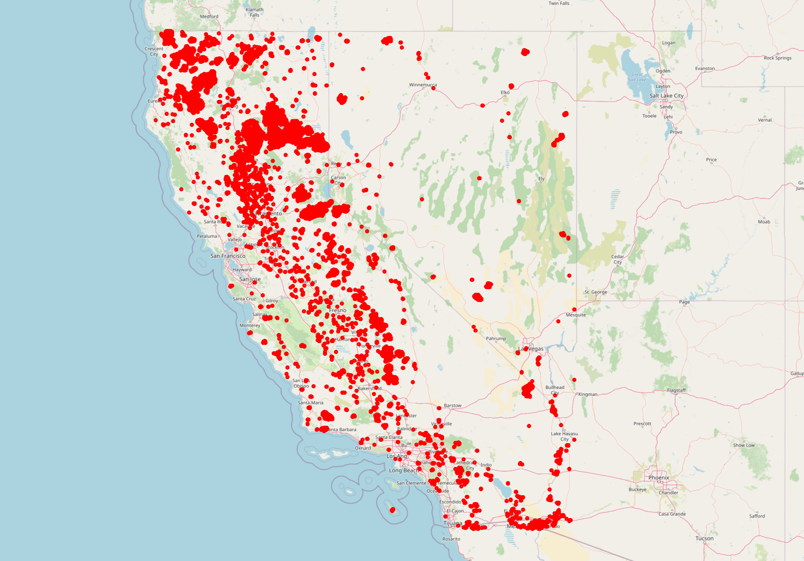

# California Wildfire Analysis

## Description
This project analyzes and visualizes wildfire data in California using MODIS satellite data. The data is processed using Python and PostgreSQL, and the results are visualized using an interactive map.

## Features
- Real-time wildfire data visualization.
- Geospatial analysis of wildfire locations.
- Interactive map with markers for fire intensity and date.

## Technologies Used
- Python
- PostgreSQL
- Folium
- Pandas
- GeoPandas

## How to Use
1. Clone the repository:
   ```bash
   git clone https://github.com/your-username/california-wildfire-analysis.git
2. Install the required dependencies:
    pip install -r requirements.txt
3. Run the geospatial analysis script:
    python scripts/geospatial_analysis.py


## Live Demo
An interactive map of California wildfires is hosted on Netlify. You can view it here:
https://california-wildfires-analysis.netlify.app

## Screenshots


## License
This project is licensed under the MIT License. See the LICENSE file for details.

